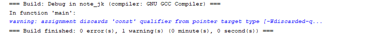

# const 的使用

记录一下, 避免以后又忘记了:

## 基本语法

```c
const <type> <variable>;
```

**注意:**

- `const` 的位置可以放在 类型左边, 也可以放在类型右边, 其语法逻辑是等价的
- 修饰的含义是 右边的 "标识符" 不可改变, 这里的 "标识符" 不是一个名字, 而是一个 "取值描述" ( 后面解释 )

```c
const int num;
// 等价于
int const num;
```

`const` 除了修饰基本数据类型外, 还可以修饰符合类型, 如:

```c
int num = 123;

const int cnum1 = num;                // cnum1 不可变

int const cnum2 = num;                // cnum2 不可变

const int *ptr_num1 = &num;           // *ptr_num1 不可变, 但是 ptr_num1 可变

int const *prt_num2 = &num;           // *ptr_num2 不可变, 但是 ptr_num2 可变

int * const ptr_num3 = &num;          // ptr_num3 不可变, 但是 *ptr_num3 是可变的

const int * const ptr_num4 = &num;    // ptr_num4 与 *ptr_num4 都不可变

```

**注意: **

- 如果创建指针指向常量, 指针也必须使用 `const` 修饰.
- 基于 C99 的标准, 常量指针在赋值的时候类型也必须保证为常量类型

```c
#include <stdio.h>
#include <stdlib.h>

int main () {

  int num = 123;
  const int *ptr_num = &num;
  int *p = &num;

  p = ptr_num;

  printf( ">> p: %p, ptr_num: %p\n", p, ptr_num  );
  return 0;
}
```

编译时会给出警告:




**小结:**

定义语法为:

```c
const int * const * ptr = ...;
```

的指针 `ptr` 的取值运算是否可变, 看 const 后的取值表达式逻辑. 上面的定义中, 可有的取值逻辑包含: `ptr`, `*ptr`, `**ptr`.
而 `const` 关键词后的取值逻辑包含: `**ptr` 和 `*ptr`, 故它们不可改, 而 `ptr` 是可以修改的:

```c
#include <stdio.h>
#include <stdlib.h>

int main () {

  int num1 = 123, num2 = 456;
  int *p1 = &num1;
  int **p2 = &p1;

  int **ptr = p2;

  printf( "输出: \n" );
  printf( "num1 = %d, num2 = %d\n", num1, num2 );
  printf( "p1: %p, *p1 = %d\n", p1, *p1 );
  printf( "p2: %p, *p2: %p, **p2 = %d\n", p2, *p2, **p2 );
  printf( "ptr: %p, *ptr: %p, **ptr = %d\n", ptr, *ptr, **ptr );

  printf( "\n修改二级指针的值( part1 ): \n" );

  *ptr = &num2;

  printf( ">> 输出: \n" );
  printf( ">> num1 = %d, num2 = %d\n", num1, num2 );
  printf( ">> p1: %p, *p1 = %d\n", p1, *p1 );
  printf( ">> p2: %p, *p2: %p, **p2 = %d\n", p2, *p2, **p2 );
  printf( ">> ptr: %p, *ptr: %p, **ptr = %d\n", ptr, *ptr, **ptr );

  printf( "\n修改二级指针的值( part2 ): \n" );

  **ptr = 789;

  printf( ">> 输出: \n" );
  printf( ">> num1 = %d, num2 = %d\n", num1, num2 );
  printf( ">> p1: %p, *p1 = %d\n", p1, *p1 );
  printf( ">> p2: %p, *p2: %p, **p2 = %d\n", p2, *p2, **p2 );
  printf( ">> ptr: %p, *ptr: %p, **ptr = %d\n", ptr, *ptr, **ptr );

  return 0;
}
```

正常执行结果:


添加 `const` 约束后, 修改 `*ptr`:

```c
...

const int * const *ptr = p2;

...

*ptr = &num2;
```

编译会报错:


修改 `**ptr` 的值:

```c
...

const int * const *ptr = p2;

...

**ptr = num2;
```

编译依旧报错:


但是, 若是修改 `ptr`:

```c
#include <stdio.h>
#include <stdlib.h>

int main () {

  int num1 = 123, num2 = 456;
  int *p1 = &num1;
  int **p2 = &p1;

  const int * const *ptr = p2;

  printf( "输出: \n" );
  printf( "num1 = %d, num2 = %d\n", num1, num2 );
  printf( "p1: %p, *p1 = %d\n", p1, *p1 );
  printf( "p2: %p, *p2: %p, **p2 = %d\n", p2, *p2, **p2 );
  printf( "ptr: %p, *ptr: %p, **ptr = %d\n", ptr, *ptr, **ptr );

  int *p = &num2;

  ptr = &p;

  printf( "输出: \n" );
  printf( "num1 = %d, num2 = %d\n", num1, num2 );
  printf( "p: %p, *p = %d\n", p, *p );
  printf( "ptr: %p, *ptr: %p, **ptr = %d\n", ptr, *ptr, **ptr );

  return 0;
}
```

编译运行都没有问题:


要消除警告, 则使用类型转换:

