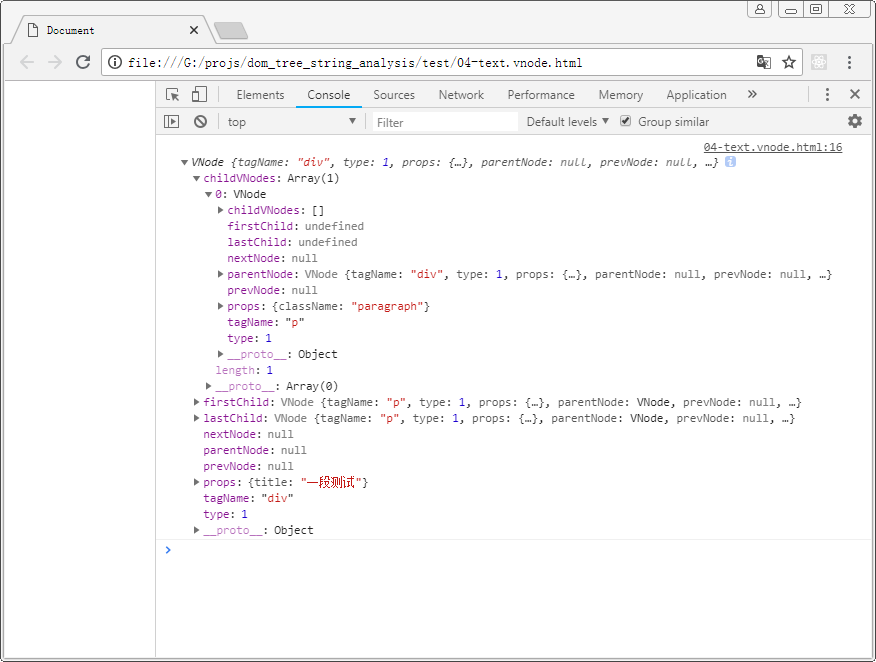
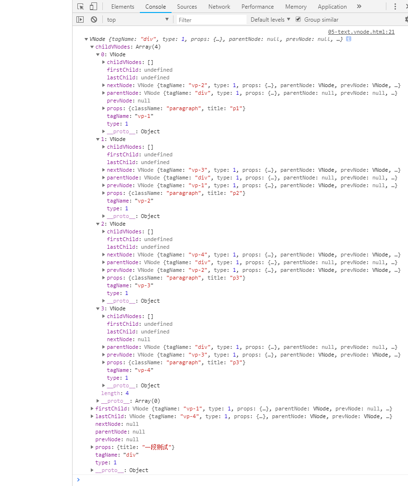
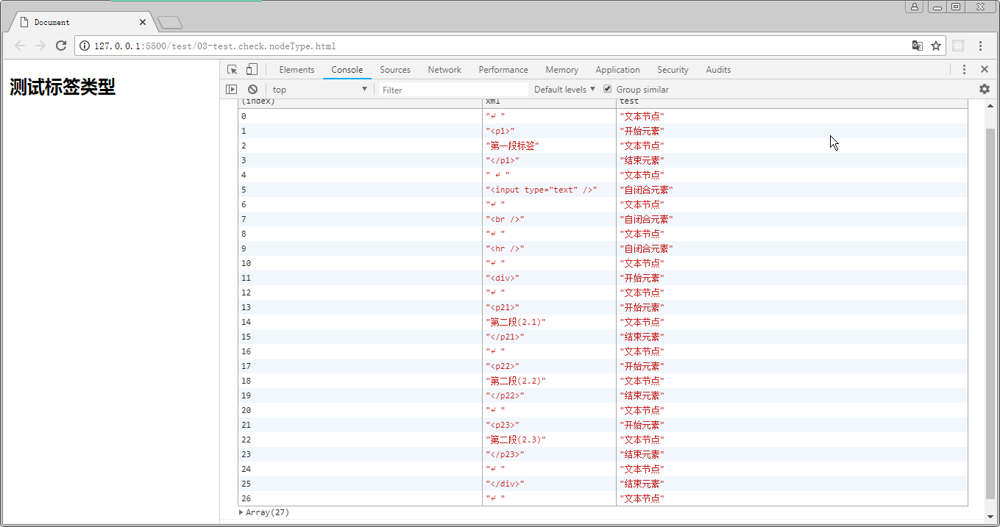

# DOM Tree String Analysis

DOM 树字符串解析
> 将 XML 格式的字符串解析成 树( 为了模拟 JSX 语法 )

## 1. 基本 parse 算法
> 用于读取 XML 格式的字符串, 并将其标签与文本分离出来


- 2018-08-14: 初步实现 `VNode` 构造函数, 简单测试:

**测试1:**

```js
var VNode = jklib.test.VNode;
var node = 
    new VNode( 'div', { title: '一段测试' }, new VNode( 'p', { className: 'paragraph' } ) );

console.log( node );
```



**测试2:**

```js
var VNode = jklib.test.VNode;

var node = new VNode( 'div', { title: '一段测试' }, 
                     new VNode( 'vp-1', { className: 'paragraph', title: 'p1' } ),
                     new VNode( 'vp-2', { className: 'paragraph', title: 'p2' } ),
                     new VNode( 'vp-3', { className: 'paragraph', title: 'p3' } ),
                     new VNode( 'vp-4', { className: 'paragraph', title: 'p3' } )  
                    );

console.log( node );
```



- 2018-08-07: 实现类型检查, 判断是文本节点还是元素节点, 并判断是元素节点是开始标签, 结束标签还是自闭合标签.



- 2018-08-07: 实现 Init 构造函数, 提供 next() 方法与 current 读取器, 来按需读取
  > 暂时要求: 必须严格按照标签的规则书写, 正文中出现的 > 与 < 必须转码
- 2018-08-06: 实现 XMLParse 函数一次性转换


