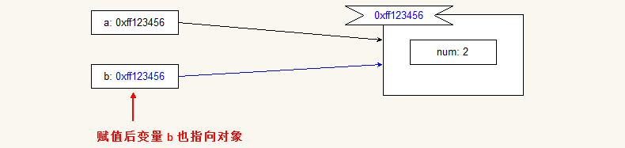

# 两个经典面试题

## 问题描述

- 看下面代码:

```javascript
var a = 0, b = 0;
function A( a ) {
    A = function ( b ) {
        alert( a + b++ );
    };
    alert( a++ );
}
A( 1 );
A( 2 );
```

分析代码的执行结果.


- 看下面代码:

```javascript
var a = { num: 2 };
var b = a;
a.num = a = { num: 4 };
console.log( a.num );
console.log( b.num );
```

分析代码的执行结果.


## 第一题解释

这一题的考点在:

- 词法作用域与变量搜索原则.
- 函数是 JavaScript 中的特殊的类型, 与普通的类型数据使用方法一样.
- 函数限定作用域, 函数的形参亦是函数内的声明.
- 若函数内部数据可被访问, 则函数内存不会被释放.
- 自增与自减运算符.


### 分析执行步骤


- 首先, 代码进行预解析. 在 js 引擎中记录下三个成员, 分别是  `a`,  `b`, 和  `A`. 预解析不会处理函数, 也不会运行代码.
- 然后代码就变成了如下样子:
```javascript
a = 0, b = 0;
A( 1 );
A( 2 );
```
- 预解析之后, 代码开始运行. 首先执行赋值运算. 将数字  `0` 分别存储到 **$1**  `a` 和  `b` 中.
- 然后第一次调用函数  `A`, 传入参数  `1`.
- 在函数内的执行步骤为:
    - 首先进行函数内的预解析. 由于函数内没有显式声明(var 定义变量, 或独立的函数声明), 因此该步骤容易被人忽略. 实际上函数的参数就是在函数内部的第一个声明, 即在函数内部有局部的变量  `a` 存在. 并且其值在函数调用时赋值为  `1`.
    - 然后依次执行函数内部的代码. 
    - 首先对  `A` 进行赋值. 根据变量的搜索规则(在访问变量时, 如果当前函数内没有变量的声明, 则到上一级作用域查找.), `A` 就是函数的引用, 因此给  `A` 赋值后, 相当于修改 **$1**  `A` 的指向,  `A` 指向匿名函数. 然后调用  `alert` 函数, 打印  `a++` 的结果.
    - 然而根据后置运算符  `++` 的特征, 表达式  `a++` 的取值为原值, 取值后  `a` 的值累加一次. 即表达式的值为  `1`, 而后  `a` 的值为  `2`.
    - 所以  `alert` 此时打印出来的结果为  `1`.
    - 由于全局变量  `A` 引用了匿名函数, 所以当前函数执行结束后, 不会立即释放函数内存. 即保存了变量  `a` 不被释放( 构成闭包结构 ). 函数执行结束.
```javascript
function ( b ) {
    alert( a + b++ );
}
```
- 然后回到代码的外层执行环境. 继续执行代码. 然后第二次调用函数  `A`, 并传入参数  `2`.
- 函数的内部执行为:
    - 由于第一次执行函数  `A` 的时候, 已重新让  `A` 指向了匿名函数. 因此调用函数  `A`,实际上是在调用匿名函数.
    - 因此首先进行函数内预解析, 发现有局部变量  `b`, 并且取值为  `2`.
    - 然后调用  `alert` 函数, 打印表达式  `a + b++` 的结果.
    - 根据后置自增运算符的运算规则, 表达式中  `b++` 的值为  `2`, 取值后  `b` 的值为  `3`.
    - 而根据闭包中保存的变量  `a` 的值为  `2` 可知, 表达式  `a + b++` 的值为  `4`.
    - 因此  `alert` 打印出  `4`. 函数执行结束.
- 最后代码执行结束.


## 第二题解释

这一题的考点在(该案例涉及到词法分析, 相对来说优点复杂. 如果理解不是很好, 可以先记下来.):


- 引用类型的变量存储的只是一个地址.
- js 代码从左往右, 从上往下解释运行.
- 代码的执行是按照运算符的结合顺序进行, 但是这个结合顺序往往被人们经验所想当然.
- js 对象具有动态特性(只要对象存在, 点赋值即可为对象创建新的成员).
- 词法分析, 连续赋值运算符构成一个栈内存结构.


### 代码分析


- 首先代码预解析, 得到两个全局变量  `a` 和  `b`;
- 然后执行代码, 根据代码的运行, 第一行代码执行完, 其内存逻辑相当于:


- 然后执行第二段代码, 将变量  `a` 中存储的 **$1**赋值给变量  `b`. 其内存逻辑为:



- 接着最复杂的一句话:  `a.num = a = { num: 4 }`. 在这段代码中, 代码的执行时从左往右的, 
      但是赋值运算符是从右往左结合的. 也就是说, 如果有代码: `console.log( 1 + 2 + 3 * 4 ); // 15`

      在这段代码中, 代码执行的顺序是什么呢? 可以先思考一下.

      按照成年人的一般计算规律, 我们都知道先算乘除, 再算加减. 因此, 很容易将代码的计算变成先计算  `3 * 4`,
      得到结果后, 再计算  `1 + 2 + 12`. 最终计算的结果是  `15`. 
      答案没有任何问题. 这是因为加法满足交换律, 运算 $1+2+3*4$ 与运算 $3*4+1+2$ 等价.
      但是这与计算机的运算是不一样的. 因为计算机的运算是 **$1**的计算.

      那么在计算机中, 上面的代码运行是, 先计算  `1 + 2`, 然后求得  `3`.
      在读入代码  `+ 3 * 4`, 发现后续运算是乘法, 因此无法在刚刚得到的结果上计算加法.
      因此将刚刚得到的结果存储起来( 入栈 ), 先计算  `3 * 4` 的结果, 得到  `12`.
      再将存储的数据取出( 出栈 ), 再把这两个数相加, 即  `3 + 12`, 最后求得结果.
      其计算顺序逻辑图为:


- 回头过来看我们的代码: 
    -  `a.num = a = { num: 4 }`, 代码从左往右读取, 首先看到  `a.num =`, 但是它现在不参与计算, 因此会将其存储起来( 入栈 ), 最后再计算. 
    - 然后读入  `a = `, 依旧不参与运算. 因此入栈.
    - 此时需要注意的是两次入栈, 入的是什么. 第一次入栈, 是通过  `a` 取得  `num`. 而  `a` 本身不存储数据, 存储的是一个地址, 因此  `a.num` 是找到了对象中的一个属性. 因此第一次入栈的是对象中的属性  `num`.
 而第二次入栈的是变量  `a`. 其内存的逻辑图可以看成:


    - 然后得到一个新的对象  `{ num: 4 }`. 进行第一次赋值, 将其地址赋值给变量  `a`. 内存逻辑图为:


然后内存中变量的引用关系就编程了:


    - 赋值表达式的值为等号右边的值, 即在完成该赋值后, 再取出栈底的  `a.num`, 但是这仅仅是形式表达式, 因为  `a` 的执行已经变量. 但是这没关系, 因此实际上出栈的是原来对象的  `num` 属性. 即逻辑图所示:


          然后赋值给它, 内存中数据的指向关系又发生了变化, 图为:


    - 该赋值运算语句结束后, 根据逻辑图, 对象  `a` 已经重新指向; 而变量  `b` 依旧执行原来的对象. 但是原来对象的  `num` 属性也发生了变化,它不再存储数字, 而是指向了新的对象.
- 最后打印两个变量对应的  `num` 值, 根据逻辑图很显然. 为了验证这个逻辑, 可以修改代码:

```javascript
var a = { num: 2, text: '`旧`' };
var b = a;
a.num = a = { num: 4, text: '`新`' };
console.log( a.num );
console.log( b.num );
```

根据前面的分析, 也可以绘制出它的内存指向逻辑图:      


将代码运行后, 在调试工具下验证有:


显然与绘制的逻辑结构一致.


