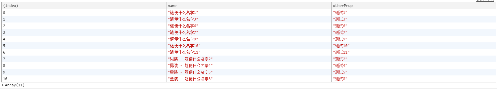

# 20181110-自定义分类排序

## 问题描述


今天是双十一, 也算是值得纪念一下. 一个曾经的学员问道一个问题:

> 今天产品出了一个 bug, 要将产品列表中 '男装' 和 '童装' 的数据放到最后. 但是数据是后台请求来的, 需要在前台排序一下.

因此就有了今天的代码.

**主要思路是构建一个排序的映射.**

数组自带排序的方法( `sort` ), 问题是怎么排序? 所以我构造一个映射, 将数组转换成数字的排序:

- 所有的产品数据都与一个数字建立关系.
- 由于需要排序的商品分成三类( '男装', '童装', '其他' ), 而 '男装' 与 '童装' 属于一个类别, 都需要放到数组结尾处.
- 因此将所有的商品按照 *男装* 或 *童装* 为 1, 其他 为 0 的方式构造映射. 
  - 至于为什么其他是 0, 这是因为数字排序 0 在前面, 1 在后面.
- 因此将需要后置的关键字构造正则表达式. 就有了下面的代码

```javascript
var data = [
  { name: '随便什么名字1', otherProp: '测试1' },
  { name: '男装 - 随便什么名字2', otherProp: '测试2' },
  { name: '随便什么名字3', otherProp: '测试3' },
  { name: '男装 - 随便什么名字4', otherProp: '测试4' },
  { name: '童装 - 随便什么名字5', otherProp: '测试5' },
  { name: '随便什么名字6', otherProp: '测试6' },
  { name: '随便什么名字7', otherProp: '测试7' },
  { name: '童装 - 随便什么名字8', otherProp: '测试8' },
  { name: '随便什么名字9', otherProp: '测试9' },
  { name: '随便什么名字10', otherProp: '测试10' },
  { name: '随便什么名字11', otherProp: '测试11' }
];

// 过滤依据
var keys = [ '男装', '童装' ];

// 构造正则
var rtmp = new RegExp( '^' + keys.join( '|^' ) );

// 排序
data.sort( ( a, b ) => {

  var v1 = Number( rtmp.test( a.name ) ),
      v2 = Number( rtmp.test( b.name ) );
  return v1 - v2;

} );

console.table( data );
```

运行结果为:

